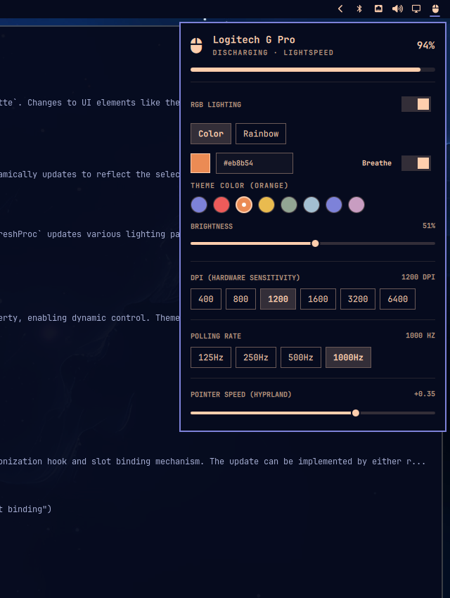

# Omarchy Mouse Plugin (`optimistprime.mouse`)

[](LICENSE)
[](#)
[](#)

A native, interactive **Omarchy shell** bar widget and control engine for Logitech gaming mice (Logitech G Pro Wireless, G Pro X Superlight, G502, G305, G703, G903) and other `libratbag`-compatible devices.



---

## ✨ Features

* **🔋 Real-time Battery Telemetry**:
  * Live battery percentage and charging state detection via sysfs (`hidpp_battery`).
  * Proportional smooth battery meter bar.
  * Right-click the bar icon to toggle inline battery percentage display on your status bar.
* **🎯 Hardware DPI Sensitivity**:
  * Instant 1-click switching between hardware DPI stages: **400**, **800**, **1200**, **1600**, **3200**, and **6400** DPI.
  * Directly committed to the mouse's onboard memory profile.
* **⚡ Polling Rate Switching**:
  * Switch hardware report rate on the fly: **125 Hz**, **250 Hz**, **500 Hz**, or **1000 Hz**.
* **🖱️ Hyprland Pointer Speed Synchronization**:
  * Live slider for desktop pointer speed (`-1.00` to `+1.00`).
  * Dynamically applied via `hyprctl` and permanently persisted to `~/.config/hypr/input.lua`.
* **🌈 RGB Lighting Suite & Omarchy Theme Synchronization**:
  * **Master Toggle**: Complete on/off switch for RGB lighting.
  * **Color Mode**:
    * Custom hex code input (`#RRGGBB`) with real-time swatch preview.
    * Clickable Omarchy theme color chips (`accent`, `red`, `orange`, `yellow`, `green`, `cyan`, `blue`, `magenta`).
    * **Dynamic Theme Slot Binding**: Selecting a theme chip binds the mouse to that color slot. Whenever you change Omarchy desktop themes (`omarchy theme set <theme>`), the mouse color automatically updates via Omarchy's native `theme-set.d` hook!
    * **Breathe Effect**: Optional hardware-driven pulsing illumination.
  * **Rainbow 360°**: Hardware-driven autonomous 360° spectrum wave cycle running directly inside the mouse MCU.
  * **Brightness Slider**: 0% to 100% LED intensity control.
* **🛡️ Zero-Daemon Hardware Architecture**:
  * All lighting modes execute directly in the mouse's internal MCU.
  * No background polling daemons or continuous RF writes — protecting wireless battery life and completely avoiding RF transceiver sleep timeouts.

---

## 🛠️ Prerequisites

Ensure your system has the standard Linux mouse daemon installed:

* **Arch Linux / Omarchy**:
  ```bash
  sudo pacman -S libratbag python
  sudo systemctl enable --now ratbagd.service
  ```

---

## 🚀 Installation

### Option 1: Install via Omarchy (Recommended)

Once published to GitHub, install directly with Omarchy's plugin manager:

```bash
omarchy plugin add https://github.com/USERNAME/omarchy-mouse-plugin.git --enable
```

Then reload the shell:
```bash
omarchy restart shell
```

### Option 2: Local Installation

Clone this repository and run the installer script:

```bash
git clone https://github.com/USERNAME/omarchy-mouse-plugin.git
cd omarchy-mouse-plugin
./install.sh
```

Ensure the widget is added to your bar layout in `~/.config/omarchy/shell.json`:
```json
{
  "bar": {
    "layout": {
      "right": [
        "optimistprime.mouse",
        "omarchy.bluetooth",
        "omarchy.network",
        "omarchy.audio"
      ]
    }
  }
}
```

Then reload your shell:
```bash
omarchy restart shell
```

---

## ⌨️ Command Line Interface (`omarchy-mouse-control`)

The backend script also provides a standalone CLI for scripting, hotkeys, or terminal inspection:

```bash
# Query complete device state as JSON
omarchy-mouse-control state

# Set DPI
omarchy-mouse-control set-dpi 1200

# Set polling report rate (Hz)
omarchy-mouse-control set-rate 1000

# Set Hyprland pointer sensitivity
omarchy-mouse-control set-sensitivity 0.35

# Lighting controls
omarchy-mouse-control set-lighting-toggle 1
omarchy-mouse-control set-lighting-mode color             # color | rainbow | off
omarchy-mouse-control set-lighting-color "#eb8b54" orange # hex [slot_name]
omarchy-mouse-control set-lighting-breathe 1              # 1 = breathe, 0 = solid
omarchy-mouse-control set-lighting-brightness 200         # 0 to 255
omarchy-mouse-control sync-theme                          # Synchronize active theme slot
```

---

## 🔬 Architecture & Design Notes

* **Self-Contained Execution**: `Panel.qml` dynamically resolves the location of `omarchy-mouse-control` in its own directory, making the plugin completely functional upon cloning without mandatory root installation.
* **Profile 0 Pinning**: Modern Logitech mice feature multiple onboard memory slots, some of which may be disabled. This daemon strictly pins all writes to `profile 0`, preventing lighting resets to default factory red.
* **Sleep Immunity**: Wireless mice enter a low-power deep RF sleep state when idle for ~1-2 minutes. By using one-shot hardware commands and Omarchy `theme-set.d` event hooks instead of continuous write loops, the mouse sleeps naturally and the 2.4 GHz Lightspeed RF link remains rock-solid.

---

## 📜 License

Distributed under the **MIT License**. See [`LICENSE`](LICENSE) for details.

Developed by **Jason Stewart (Optimist Prime)**.
